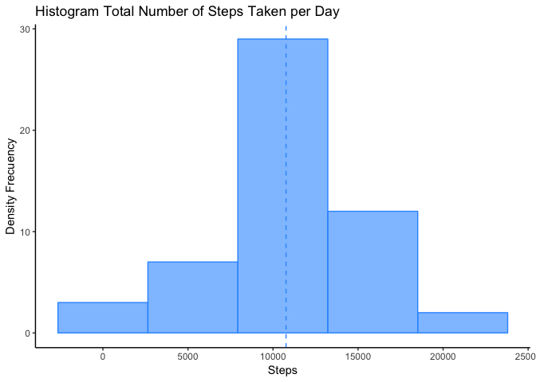
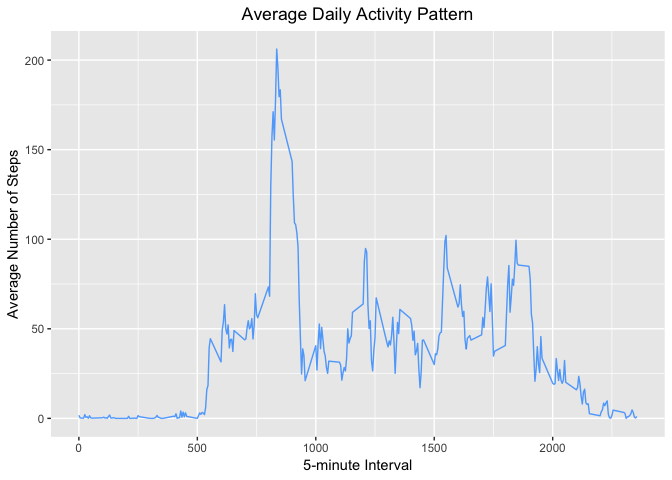
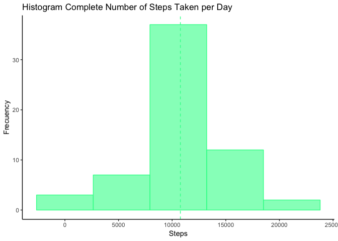
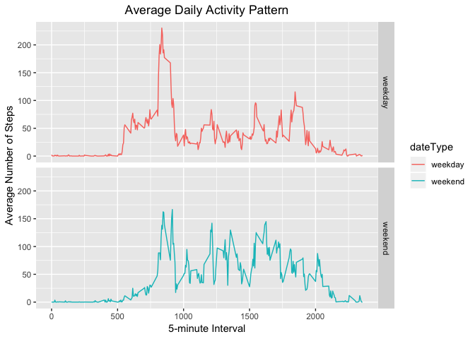

This assignment will be described in multiple parts. You will need to write a report that answers the questions detailed below. Ultimately, you will need to complete the entire assignment in a **single R markdown** document that can be processed by **knitr** and be transformed into an HTML file.

Throughout your report make sure you always include the code that you used to generate the output you present. When writing code chunks in the R markdown document, always use <span style="color:#ff9933">echo = TRUE</span> so that someone else will be able to read the code. **This assignment will be evaluated via peer assessment so it is essential that your peer evaluators be able to review the code for your analysis**.

For the plotting aspects of this assignment, feel free to use any plotting system in R (i.e., base, lattice, ggplot2)

Fork/clone the [GitHub repository created for this assignment](https://github.com/rdpeng/RepData_PeerAssessment1). You will submit this assignment by pushing your completed files into your forked repository on GitHub. The assignment submission will consist of the URL to your GitHub repository and the SHA-1 commit ID for your repository state.

>**NOTE:** The GitHub repository also contains the dataset for the assignment so you do not have to download the data separately.

## Loading and preprocessing the data
Show any code that is needed to  

1. Load the data (i.e. <span style="color:#ff9933">read.csv()</span>)
```r
# load file
if (!file.exists('activity.csv')) unzip(zipfile = 'activity.zip')
#
activityData <- read.csv(file='activity.csv', header = T)
```


2. Process/transform the data (if necessary) into a format suitable for your analysis
```r
library(knitr)
library(kableExtra)
kable(  head(activityData[complete.cases(activityData),]), 
            "html", booktabs = T, align = "c", caption = "Activity Data") %>%
        kable_styling(  bootstrap_options = c("striped", "hover", "condensed", "responsive"), 
                        full_width = F, position = "left") %>%
        add_footnote(c("Only head data"))
```
<table class="table table-striped table-hover table-condensed table-responsive" style="width: auto !important; ">
<caption>Activity Data</caption>
 <thead>
  <tr>
   <th style="text-align:left;">   </th>
   <th style="text-align:center;"> steps </th>
   <th style="text-align:center;"> date </th>
   <th style="text-align:center;"> interval </th>
  </tr>
 </thead>
<tbody>
  <tr>
   <td style="text-align:left;"> 289 </td>
   <td style="text-align:center;"> 0 </td>
   <td style="text-align:center;"> 2012-10-02 </td>
   <td style="text-align:center;"> 0 </td>
  </tr>
  <tr>
   <td style="text-align:left;"> 290 </td>
   <td style="text-align:center;"> 0 </td>
   <td style="text-align:center;"> 2012-10-02 </td>
   <td style="text-align:center;"> 5 </td>
  </tr>
  <tr>
   <td style="text-align:left;"> 291 </td>
   <td style="text-align:center;"> 0 </td>
   <td style="text-align:center;"> 2012-10-02 </td>
   <td style="text-align:center;"> 10 </td>
  </tr>
  <tr>
   <td style="text-align:left;"> 292 </td>
   <td style="text-align:center;"> 0 </td>
   <td style="text-align:center;"> 2012-10-02 </td>
   <td style="text-align:center;"> 15 </td>
  </tr>
  <tr>
   <td style="text-align:left;"> 293 </td>
   <td style="text-align:center;"> 0 </td>
   <td style="text-align:center;"> 2012-10-02 </td>
   <td style="text-align:center;"> 20 </td>
  </tr>
  <tr>
   <td style="text-align:left;"> 294 </td>
   <td style="text-align:center;"> 0 </td>
   <td style="text-align:center;"> 2012-10-02 </td>
   <td style="text-align:center;"> 25 </td>
  </tr>
</tbody>
<tfoot>
<tr>
<td style = 'padding: 0; border:0;' colspan='100%'><sup>a</sup> head data without NAs</td>
</tr>
</tfoot>
</table>


## What is mean total number of steps taken per day?
For this part of the assignment, you can ignore the missing values in the dataset.

1. Calculate the total number of steps taken per day
```r
# Total steps taken per day
totalSteps <- aggregate(steps ~ date, activityData, FUN=sum)
```


2. If you do not understand the difference between a histogram and a barplot, research the difference between them. Make a histogram of the total number of steps taken each day
```r
# Make a histogram of the total number of steps taken per day
library(ggplot2)
ggplot(totalSteps, aes(x=steps)) + 
        geom_histogram(bins = 5, alpha = 0.6, fill = "#3399FF", color = "#3399FF") +
        geom_vline(aes(xintercept = mean(totalSteps$steps)), linetype = "dashed", color = "#3399FF") + 
        labs(title = "Histogram Total Number of Steps Taken per Day", x = "Steps", y = "Density Frecuency") +
        theme_classic()
```
<!-- -->

3. Calculate and report the mean and median of the total number of steps taken per day
```r
# mean and median of total steps taken per day
meanSteps <- mean(totalSteps$steps, na.rm = TRUE)
medSteps <- median(totalSteps$steps, na.rm = TRUE)
#
library(knitr)
library(kableExtra)
kable(data.frame(formatC(meanSteps, format = "e", digits = 2), medSteps),
      col.names = c("Mean",
                    "Median"),
      "html", booktabs = T, align = "c", caption = "Number of Steps Taken per Day") %>%
    kable_styling(bootstrap_options = c("striped", "hover", "condensed", "responsive"),
                full_width = F, position = "left") %>%
    column_spec(1:2, width = "10em",)
```
<table class="table table-striped table-hover table-condensed table-responsive" style="width: auto !important; ">
<caption>Number of Steps Taken per Day</caption>
 <thead>
  <tr>
   <th style="text-align:center;"> Mean </th>
   <th style="text-align:center;"> Median </th>
  </tr>
 </thead>
<tbody>
  <tr>
   <td style="text-align:center;width: 10em; "> 1.08e+04 </td>
   <td style="text-align:center;width: 10em; "> 10765 </td>
  </tr>
</tbody>
</table>


## What is the average daily activity pattern?
1. Make a time series plot (i.e. <span style="color:#ff9933">type = "l"</span>) of the 5-minute interval (x-axis) and the average number of steps taken, averaged across all days (y-axis)
```r
library(ggplot2)
meanStepsByInt <- aggregate(steps ~ interval, activityData, mean)
ggplot(data = meanStepsByInt, aes(x = interval, y = steps)) +
  geom_line(alpha = 0.8, color = "#3399FF") +
  labs( title = "Average Daily Activity Pattern", 
            x = "5-minute Interval", y = "Average Number of Steps") +
  theme(plot.title = element_text(hjust = 0.5))
```
<!-- -->

2. Which 5-minute interval, on average across all the days in the dataset, contains the maximum number of steps?  
```r
indexMax <- which.max(meanStepsByInt$steps)     
maxInt <- meanStepsByInt[indexMax,]
#
library(knitr)
library(kableExtra)
kable(maxInt, "html", booktabs = T, align = "c", caption = "Maximum number of steps") %>%
  kable_styling(    bootstrap_options = c("striped", "hover", "condensed", "responsive"),
                        full_width = F, position = "left") %>%
      column_spec(2:3, width = "8em")
```
<table class="table table-striped table-hover table-condensed table-responsive" style="width: auto !important; ">
<caption>Maximum number of steps</caption>
 <thead>
  <tr>
   <th style="text-align:left;">   </th>
   <th style="text-align:center;"> interval </th>
   <th style="text-align:center;"> steps </th>
  </tr>
 </thead>
<tbody>
  <tr>
   <td style="text-align:left;"> 104 </td>
   <td style="text-align:center;width: 8em; "> 835 </td>
   <td style="text-align:center;width: 8em; "> 206.1698 </td>
  </tr>
</tbody>
</table>

## Imputing missing values

Note that there are a number of days/intervals where there are missing
values (coded as <span style="color:#ff9933">NA</span>). The presence of missing days may introduce
bias into some calculations or summaries of the data.

1. Calculate and report the total number of missing values in the dataset (i.e. the total number of rows with <span style="color:#ff9933">NA</span>'s)  
```r
# span outside from ```{r echo = FALSE, results = 'asis'} .... ```
<span style="color:#ff9933">
          missingVals <- sum(is.na(activityData$steps))
          cat(paste0("Number of missing values: ", missingVals))
</span>
```
<span style="color:#ff9933">
Number of missing values: 2304
</span>

2. Devise a strategy for filling in all of the missing values in the dataset. The strategy does not need to be sophisticated. For example, you could use the mean/median for that day, or the mean for that 5-minute interval, etc.
```r
map <- match(activityData$interval, meanStepsByInt$interval)
mapMean <- meanStepsByInt$steps[map]
```


3. Create a new dataset that is equal to the original dataset but with the missing data filled in.
```r
complete_actData <- transform(  activityData,
                                    steps = ifelse(
                                                is.na(activityData$steps),
                                                mapMean,
                                                activityData$steps))
```


4. Make a histogram of the total number of steps taken each day and Calculate and report the **mean** and **median** total number of steps taken per day. Do these values differ from the estimates from the first part of the assignment? What is the impact of imputing missing data on the estimates of the total daily number of steps?
```r
compStepsTotal <- aggregate(steps ~ date, complete_actData, FUN=sum)
#
library(ggplot2)
ggplot(compStepsTotal, aes(x=steps)) + 
        geom_histogram(bins = 5,
                   alpha = 0.6, fill = "#33ff99", color = "#33ff99") +
        geom_vline(aes(xintercept=mean(totalSteps$steps)),
               linetype = "dashed", color = "#33ff99") + 
        labs(title = "Histogram Complete Number of Steps Taken per Day", x = "Steps", y = "Frecuency") +
        theme_classic()
```
<!-- -->
```r
compMeanSteps <- mean(compStepsTotal$steps, na.rm = TRUE)
compMedSteps <- median(compStepsTotal$steps, na.rm = TRUE)
#
difMean = format(compMeanSteps - meanSteps, nsmall = 4)
difMed = formatC(compMedSteps - medSteps, format = "f", digits = 4)
difTotal = formatC(sum(compStepsTotal$steps) - sum(totalSteps$steps), format = "e", digits = 2)
#
library(knitr)
library(kableExtra)
kable(data.frame(Difference = c("Mean", "Median","Total"), Values = c(difMean,difMed,difTotal)),
        "html", booktabs = T, align = "c", caption = "Difference between missing and complete data") %>%
        kable_styling(bootstrap_options = c("striped", "hover", "condensed", "responsive"),
                full_width = F, position = "left") %>%
        column_spec(1:2, width = "11em")
```
<table class="table table-striped table-hover table-condensed table-responsive" style="width: auto !important; ">
<caption>Difference between missing and complete data</caption>
 <thead>
  <tr>
   <th style="text-align:center;"> Difference </th>
   <th style="text-align:center;"> Values </th>
  </tr>
 </thead>
<tbody>
  <tr>
   <td style="text-align:center;width: 11em; "> Mean </td>
   <td style="text-align:center;width: 11em; "> 0.0000 </td>
  </tr>
  <tr>
   <td style="text-align:center;width: 11em; "> Median </td>
   <td style="text-align:center;width: 11em; "> 1.1887 </td>
  </tr>
  <tr>
   <td style="text-align:center;width: 11em; "> Total </td>
   <td style="text-align:center;width: 11em; "> 8.61e+04 </td>
  </tr>
</tbody>
</table>

## Are there differences in activity patterns between weekdays and weekends?

For this part the <span style="color:#ff9933">weekdays()</span> function may be of some help here. Use
the dataset with the filled-in missing values for this part.

1. Create a new factor variable in the dataset with two levels -- "weekday" and "weekend" indicating whether a given date is a weekday or weekend day.
```r
compStepsTotal <- aggregate(steps ~ date + interval, complete_actData, sum)
compStepsTotal$dateType <- ifelse(as.POSIXlt(compStepsTotal$date)$wday %in% c(0,6), 'weekend', 'weekday')
```


1. Make a panel plot containing a time series plot (i.e. <span style="color:#ff9933">type = "l"</span>) of the 5-minute interval (x-axis) and the average number of steps taken, averaged across all weekday days or weekend days (y-axis). The plot should look something like the following, which was created using **simulated data**:
```r
library(ggplot2)
compStepsMean <- aggregate(steps ~ interval + dateType, compStepsTotal, mean)
#
ggplot(data = compStepsMean, aes(x = interval, y = steps, colour=dateType)) +
  geom_line() +
  facet_grid(dateType ~ .) +
  labs(title = "Average Daily Activity Pattern"
         , x = "5-minute Interval", y = "Average Number of Steps") +
  theme(plot.title = element_text(hjust = 0.5))
```
<!-- -->

